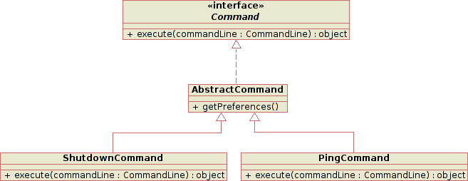
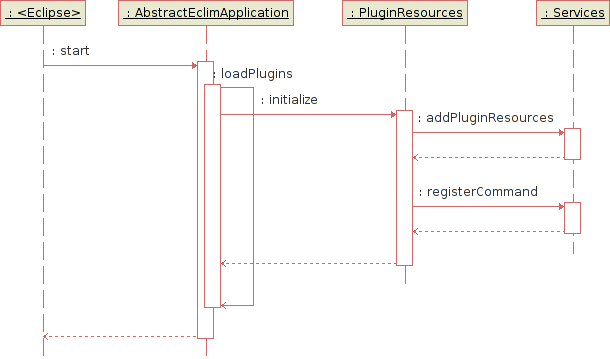

.. Copyright (C) 2005 - 2011  Eric Van Dewoestine

   This program is free software: you can redistribute it and/or modify
   it under the terms of the GNU General Public License as published by
   the Free Software Foundation, either version 3 of the License, or
   (at your option) any later version.

   This program is distributed in the hope that it will be useful,
   but WITHOUT ANY WARRANTY; without even the implied warranty of
   MERCHANTABILITY or FITNESS FOR A PARTICULAR PURPOSE.  See the
   GNU General Public License for more details.

   You should have received a copy of the GNU General Public License
   along with this program.  If not, see <http://www.gnu.org/licenses/>.

.. _development/architecture:

Eclim Architecture
==================

The eclim architecture is pretty straight forward.  Commands issued by a user
in vim are relayed via nailgun_ to the running eclim daemon and the proper
command implementation is then located and executed.

Here is a diagram showing the sequence in a bit more detail:

.. image:: ../images/diagrams/command_sequence.png

The commands which are executed on the eclimd side are also fairly simply.
They accept an object containing the command line parameters passed into the
eclimd invocation and then return an object (String, Collection, etc) which is
converted to a json response.  Below is a simple class diagram showing the
hierarchy of a couple typical commands.

Another important aspect of eclim's architecture is support for plugins.
Plugins for eclim are bundled as eclipse plugins with their auto start
attribute set to false.  When the eclim daemon starts it will locate and load
any eclipse plugin with an 'org.eclim.' prefix.

When a plugin is loaded, eclim will locate the plugin's required resources
provider and invoke its initialize method which will then inject its resources
(messages, command options, etc) into eclim and register any new commands.

Here is graphical representation of this process:

.. _nailgun: http://www.martiansoftware.com/nailgun/
