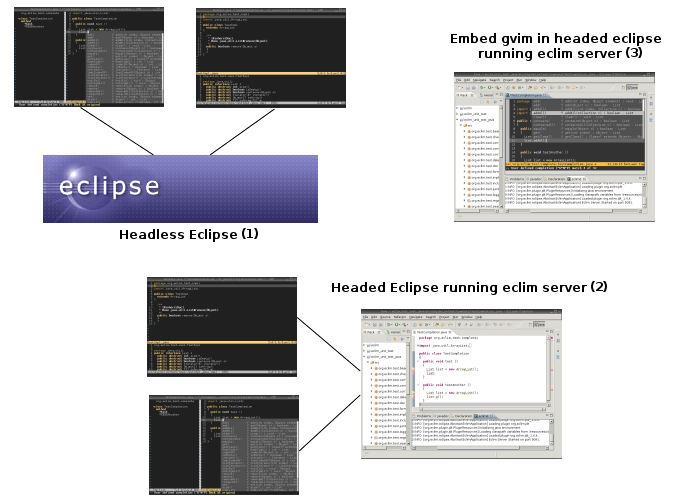

.. Copyright (C) 2005 - 2014  Eric Van Dewoestine

   This program is free software: you can redistribute it and/or modify
   it under the terms of the GNU General Public License as published by
   the Free Software Foundation, either version 3 of the License, or
   (at your option) any later version.

   This program is distributed in the hope that it will be useful,
   but WITHOUT ANY WARRANTY; without even the implied warranty of
   MERCHANTABILITY or FITNESS FOR A PARTICULAR PURPOSE.  See the
   GNU General Public License for more details.

   You should have received a copy of the GNU General Public License
   along with this program.  If not, see <http://www.gnu.org/licenses/>.

Welcome to Eclim
==================

.. rst-class:: lead

The power of Eclipse in your favorite editor.

.. toctree::
   :hidden:

   install
   gettingstarted
   gettinghelp
   vim/index
   development/index
   faq
   features
   cheatsheet
   changes
   contribute
   relatedprojects

==================
What is it?
==================

Eclim provides the ability to access Eclipse_ code editing features (code
completion, searching, code validation, and :doc:`many more </features>`) via
the command line or a local network connection, allowing those features to be
integrated with your favorite editor. Eclim provides an integration with Vim_,
but :doc:`third party clients </relatedprojects>` have been created to add eclim
support to other editors as well (emacs, sublime text 2, textmate).

There are three primary usage scenarios in which eclim is designed to be used:

#. The :ref:`first scenario <eclimd-headless>` is for those for which vim is
   their primary editing interface.  In this scenario you run a headless
   instance of eclipse which all vim instances can then communicate with to
   provide the various eclipse features.

#. The :ref:`second scenario <eclimd-headed>` is for those who prefer using vim
   as their main interface, but frequently end up jumping back to eclipse for
   any features not provided by eclim.  In this case you can run the eclim
   server inside of the eclipse gui and then interact with it via external vim
   instances just like the first scenario.

#. The :ref:`last scenario <gvim-embedded>` is for those who wish to use the
   eclipse interface full time, but want to use gvim as an embedded eclipse
   editor. Just like the previous use case, the eclim server is run inside of
   the eclipse gui and the embedded gvim will interact with it just like
   external vim instances would. This feature is only support on Windows and
   Unix systems (where gvim is compiled with the gtk gui).

   .. note::

     Please be aware that the embedded vim does not behave like a standard
     eclipse editor. It's a separate program (vim) embedded into eclipse, so
     eclipse features are provided by eclim's vim plugins and not the usual
     eclipse key bindings, context menus, etc. For those that just want vim like
     key bindings in their eclipse editors, vrapper_ is an excellent alternative
     which provides exactly that.

Eclim is released under the GPLv3_.

========================
How do I get/install it?
========================

You can follow the :doc:`eclim install guide </install>` which will walk you
through downloading and installing eclim.

================
How do I use it?
================

After you've installed eclim, you can refer to the :doc:`getting started
</gettingstarted>` page which will walk you through creating your first
project.

=====================
Where can I get help?
=====================

.. include:: /gettinghelp.rst
   :start-after: begin-help
   :end-before: end-help

======================
How do I report a bug?
======================

.. include:: /gettinghelp.rst
   :start-after: begin-report-bug
   :end-before: end-report-bug

===========
What's New?
===========

.. image:: images/rss.png
   :target: index.rss
   :alt: Rss Feed for What's New

.. rss::
   :title: Eclim: What's New
   :description: Latest news for eclim (eclipse + vim).
   :end-before: end-rss

Aug 24, 2014
-------------

Eclim has **finally** been released with Eclipse Luna support. Please note
however that scala support is disabled in this release. I tried waiting for a
final release of ScalaIDE 4.0.0 for Luna, but I don't want to hold up the rest
of eclim any longer. If you want to use eclim's scala support, you'll need to
install the ScalaIDE 4.0.0 milestone and build eclim from the master git branch.

- :ref:`Eclim 2.4.0 <2.4.0>`

May 07, 2014
-------------

Release of eclim for indigo users.

- :ref:`Eclim 1.7.19 <1.7.19>`

Apr. 12, 2014
-------------

Eclim has been updated to fix an issue on Windows that could prevent many
features from working.

- :ref:`Eclim 2.3.4 <2.3.4>`

Apr. 06, 2014
-------------

This release includes many bug fixes and refinements as well as a rewrite of
eclim's python support to utilize pydev instead of rope.

- :ref:`Eclim 2.3.3 <2.3.3>`

.. warning::

  Any exiting eclim python projects you have should be re-created with the new
  ``python`` nature:

  ::

    :ProjectCreate /path/to/project -n python

Sep. 12, 2013
-------------

This release fixes the extraction of the necessary vim files when installing
scala support.

- :ref:`Eclim 2.3.2 <2.3.2>` for Eclipse 4.3 (Kepler).
- :ref:`Eclim 1.7.18 <1.7.18>` for Eclipse 3.7/3.8 (Indigo).

Jul. 27, 2013
-------------

The previous eclim installer for Kepler was still pointing at the Juno update
site. This release remedies that.

- :ref:`Eclim 2.3.1 <2.3.1>` for Eclipse 4.3 (Kepler).

Jul. 21, 2013
-------------

The focus of this release is to bring eclim fully up to date with Eclipse Kepler
support. The installer for eclim 2.3.0 now requires that you install against
Kepler.

- :ref:`Eclim 2.3.0 <2.3.0>` for Eclipse 4.3 (Kepler).
- :ref:`Eclim 1.7.17 <1.7.17>` for Eclipse 3.7/3.8 (Indigo).

Jul. 14, 2013
-------------

This is primarily a bug fix release with a few new features. Unless some
critical error is found, this will be the last release targeting Juno. The next
release will likely target Kepler though this release should work fine on Kepler
as well, with the exception of scala support which has not been tested. Indigo
support will continue but will likely end with the release of Luna, possibly
sooner.

- :ref:`Eclim 2.2.7 <2.2.7>` for Eclipse 4.2 (Juno).
- :ref:`Eclim 1.7.16 <1.7.16>` for Eclipse 3.7/3.8 (Indigo).

May 18, 2013
-------------

Eclim has been updated to support the Android Development Toolkit version
22.0.0, scala is now supported for both Juno and Indigo, and there are a few
other improvements and many bug fixes.

- :ref:`Eclim 2.2.6 <2.2.6>` for Eclipse 4.2 (Juno).
- :ref:`Eclim 1.7.14 <1.7.14>` for Eclipse 3.7/3.8 (Indigo).

Nov. 25, 2012
-------------

The most notable change in this release is support for Eclipse 3.8 with the
Indigo release (1.7.13). Both releases also include several small bug fixes.

- :ref:`Eclim 2.2.5 <2.2.5>` for Eclipse 4.2 (Juno).
- :ref:`Eclim 1.7.13 <1.7.13>` for Eclipse 3.7/3.8 (Indigo).

Nov. 18, 2012
-------------

This is another bug fix release which includes support for the latest Android
development toolkit (21.0.0).

- :ref:`Eclim 2.2.4 <2.2.4>` for Eclipse 4.2 (Juno).
- :ref:`Eclim 1.7.12 <1.7.12>` for Eclipse 3.7 (Indigo).

Oct. 19, 2012
-------------

This is a bug fix release for Windows users which fixes executing of eclim
commands from vim:

- :ref:`Eclim 2.2.3 <2.2.3>` for Eclipse 4.2 (Juno).
- :ref:`Eclim 1.7.11 <1.7.11>` for Eclipse 3.7 (Indigo).

Oct. 07, 2012
-------------

Two new eclim updates are once again available with several bug fixes and
improvements.

- :ref:`Eclim 2.2.2 <2.2.2>` for Eclipse 4.2 (Juno).
- :ref:`Eclim 1.7.10 <1.7.10>` for Eclipse 3.7 (Indigo).

Sep. 09, 2012
-------------

| :ref:`Eclim 1.7.9 <1.7.9>` for Eclipse 3.7 (Indigo) is now available.
| This release adds initial support for :doc:`scala </vim/scala/index>`.

Please note that the `Scala IDE <http://scala-ide.org>`_ , which eclim uses to
provide scala support, is not yet available for Eclipse 4.2 (Juno), so eclim's
scala support will not be available for the eclim 2.2.x releases until sometime
after the Scala IDE has been updated for Juno.

Sep. 01, 2012
-------------

Another set of releases are now available for both Juno and Indigo. These both
include several bug fixes along with new support for creating android projects.

- :ref:`Eclim 2.2.1 <2.2.1>` for Eclipse 4.2 (Juno).
- :ref:`Eclim 1.7.8 <1.7.8>` for Eclipse 3.7 (Indigo).

Eclim also has a newly redesigned site using the
`sphinx bootstrap theme <https://github.com/ervandew/sphinx-bootstrap-theme>`_.

Aug. 07, 2012
-------------

Two new versions of eclim have been released, one for the latest Eclipse
version, Juno, the other a bug fix release for the previous version of Eclipse,
Indigo.

- :ref:`Eclim 2.2.0 <2.2.0>` for Eclipse 4.2 (Juno).
- :ref:`Eclim 1.7.7 <1.7.7>` for Eclipse 3.7 (Indigo).

Jun. 07, 2012
-------------

| :ref:`Eclim 1.7.6 <1.7.6>` is now available.
| This is a minor bug fix release.

Jun. 03, 2012
-------------

| :ref:`Eclim 1.7.5 <1.7.5>` is now available.
| This is a minor release with an improved installer, some bug fixes, and a few
  minor enhancements.

Apr. 22, 2012
-------------

| :ref:`Eclim 1.7.4 <1.7.4>` is now available.
| This is a bug fix release.

Mar. 18, 2012
-------------

| :ref:`Eclim 1.7.3 <1.7.3>` is now available.
| This version fixes numerious small bugs and adds a handful of small features.

.. warning::

   Non vim users (emacs-eclim, subclim, etc.): The underlying command response
   format for eclim has changed, which means that any project relying on the
   old format isn't going to work. So if you are installing eclim for use with
   a client other than vim, then be sure to check with the client project to
   see if it has been updated for eclim 1.7.3 or later.

.. end-rss

:doc:`/archive/news`

.. _eclipse: http://eclipse.org
.. _vim: http://www.vim.org
.. _gplv3: http://www.gnu.org/licenses/gpl-3.0-standalone.html
.. _vrapper: http://vrapper.sourceforge.net/home/
