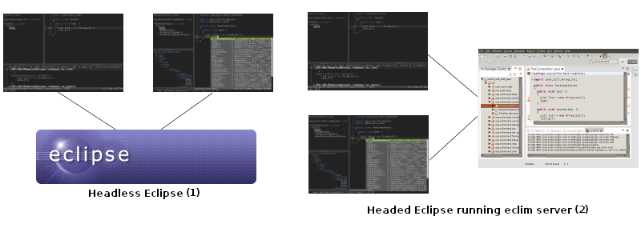

.. Copyright (C) 2005 - 2018  Eric Van Dewoestine

   This program is free software: you can redistribute it and/or modify
   it under the terms of the GNU General Public License as published by
   the Free Software Foundation, either version 3 of the License, or
   (at your option) any later version.

   This program is distributed in the hope that it will be useful,
   but WITHOUT ANY WARRANTY; without even the implied warranty of
   MERCHANTABILITY or FITNESS FOR A PARTICULAR PURPOSE.  See the
   GNU General Public License for more details.

   You should have received a copy of the GNU General Public License
   along with this program.  If not, see <http://www.gnu.org/licenses/>.

Welcome to Eclim
==================

.. rst-class:: lead

The power of Eclipse in your favorite editor.

.. toctree::
   :hidden:

   install
   gettingstarted
   gettinghelp
   vim/index
   development/index
   faq
   features
   cheatsheet
   changes
   contribute
   relatedprojects

==================
What is it?
==================

Eclim provides the ability to access Eclipse_ code editing features (code
completion, searching, code validation, and :doc:`many more </features>`) via
the command line or a local network connection, allowing those features to be
integrated with your favorite editor. Eclim provides an integration with Vim_,
but :doc:`third party clients </relatedprojects>` have been created to add eclim
support to other editors as well (emacs, sublime text 2, textmate).

There are three primary usage scenarios in which eclim is designed to be used:

#. The :ref:`first scenario <eclimd-headless>` is for those for which vim is
   their primary editing interface.  In this scenario you run a headless
   instance of eclipse which all vim instances can then communicate with to
   provide the various eclipse features.

#. The :ref:`second scenario <eclimd-headed>` is for those who prefer using vim
   as their main interface, but frequently end up jumping back to eclipse for
   any features not provided by eclim.  In this case you can run the eclim
   server inside of the eclipse gui and then interact with it via external vim
   instances just like the first scenario.

#. The :ref:`last scenario <gvim-embedded>` is for those who wish to use the
   eclipse interface full time, but want to use gvim as an embedded eclipse
   editor. Just like the previous use case, the eclim server is run inside of
   the eclipse gui and the embedded gvim will interact with it just like
   external vim instances would. This feature is only support Linux systems
   (where gvim is compiled with the gtk gui).

   .. note::

     Please be aware that the embedded vim does not behave like a standard
     eclipse editor. It's a separate program (vim) embedded into eclipse, so
     eclipse features are provided by eclim's vim plugins and not the usual
     eclipse key bindings, context menus, etc. For those that just want vim like
     key bindings in their eclipse editors, vrapper_ is an excellent alternative
     which provides exactly that.

Eclim is released under the GPLv3_.

========================
How do I get/install it?
========================

You can follow the :doc:`eclim install guide </install>` which will walk you
through downloading and installing eclim.

================
How do I use it?
================

After you've installed eclim, you can refer to the :doc:`getting started
</gettingstarted>` page which will walk you through creating your first
project.

=====================
Where can I get help?
=====================

.. include:: /gettinghelp.rst
   :start-after: begin-help
   :end-before: end-help

======================
How do I report a bug?
======================

.. include:: /gettinghelp.rst
   :start-after: begin-report-bug
   :end-before: end-report-bug

===========
What's New?
===========

.. image:: images/rss.png
   :target: index.rss
   :alt: Rss Feed for What's New

.. rss::
   :title: Eclim: What's New
   :description: Latest news for eclim (eclipse + vim).
   :end-before: end-rss

Jan 01, 2018
-------------

Eclim has an all new installer that runs entirely on the command line and now
supports the new Eclipse directory layout used by the Eclipse GUI installer.

.. note::

  Windows support has been removed. Going forward eclim will only officially
  support Linux and OSX.

- :ref:`Eclim 2.7.1 <2.7.1>`

Jul 12, 2017
-------------

A new version of eclim is now available with support for Eclipse 4.7 (Oxygen).

- :ref:`Eclim 2.7.0 <2.7.0>`

.. end-rss

:doc:`/archive/news`

.. _eclipse: http://eclipse.org
.. _vim: http://www.vim.org
.. _gplv3: http://www.gnu.org/licenses/gpl-3.0-standalone.html
.. _vrapper: http://vrapper.sourceforge.net/home/
