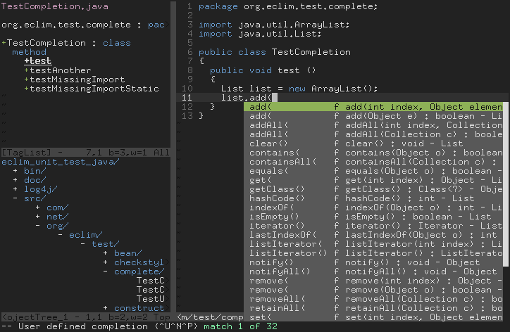

.. Copyright (C) 2005 - 2012  Eric Van Dewoestine

   This program is free software: you can redistribute it and/or modify
   it under the terms of the GNU General Public License as published by
   the Free Software Foundation, either version 3 of the License, or
   (at your option) any later version.

   This program is distributed in the hope that it will be useful,
   but WITHOUT ANY WARRANTY; without even the implied warranty of
   MERCHANTABILITY or FITNESS FOR A PARTICULAR PURPOSE.  See the
   GNU General Public License for more details.

   You should have received a copy of the GNU General Public License
   along with this program.  If not, see <http://www.gnu.org/licenses/>.

.. _vim/code_completion:

Code Completion
===============

All the code completion functionality provided by eclim (ant, java, etc) makes
use of the new "User Defined Completion" added to Vim 7.  To initiate code
completion enter insert mode and type *Ctrl-X Ctrl-U*.  By default Vim will
open a popup if there is more than one completion.

Example with java completion

Once you have started the completion you can use *Ctrl-N* to proceed to the
next match and *Ctrl-P* to move to the previous match.

If you are like me and you find those key strokes a bit cumbersome, then you
can use the SuperTab_ plugin which allows you to use the Tab key for
completion.

Another option, which can be used in lieu of or with SuperTab, is the
AutoComplPop_ plugin, which will automatically trigger code completion as you
type.

AutoComplPop by default only supports triggering code completion for file types
who have an omni completion that ships with vim, but you can configure it to
support eclim code completion. Here is an example of some vim script you can
add to your vimrc to enabled AutoComlPop for java file types (this example will
trigger the completion popup when at least 3 characters have been typed after a
dot, but you can tweak this to your tastes):

.. code-block:: vim

  let g:acp_behaviorJavaEclimLength = 3
  function MeetsForJavaEclim(context)
    return g:acp_behaviorJavaEclimLength >= 0 &&
          \ a:context =~ '\k\.\k\{' . g:acp_behaviorJavaEclimLength . ',}$'
  endfunction
  let g:acp_behavior = {
      \ 'java': [{
        \ 'command': "\<c-x>\<c-u>",
        \ 'completefunc' : 'eclim#java#complete#CodeComplete',
        \ 'meets'        : 'MeetsForJavaEclim',
      \ }]
    \ }

To find out more about Vim's insert completion execute

  **:h ins-completion**

from within Vim.

Using temp files for code completion
------------------------------------

By default, when performing code completion, eclim must first save the file to
disk so that when requesting code completion proposals from eclipse, eclipse
can pull the current contents from the file system. The downside to this is
that it alters vim's save state of the file.

Take the scenario where you perform the following steps:
  #. Open an existing file (vim shows that the file is unmodified)
  #. Type some code (vim show that the file is modified)
  #. Perform code completion.
  #. Undo all changes.

At this point vim will show the file as modified because since eclim had to save
the file at step 3.

While not much an issue this behavior can be a bit annoying for some users, so
eclim provides optional support for saving the file contents to a temp file and
having eclipse provide completion proposals using that file, alleviating the
need to save your actual file to disk. To enable this simply add the following to your vimrc:

.. code-block:: vim

  let g:EclimUseTempFiles = 1

Please note that this feature is considered beta (I haven't run into any
problems with it, but at least one user wouldn't always get results on c++
completion), so if you encounter problems consider disable this and reporting
the problem to the eclim-user_ mailing list.

.. _supertab: http://www.vim.org/scripts/script.php?script_id=1643
.. _autocomplpop: http://www.vim.org/scripts/script.php?script_id=1879
.. _eclim-user: http://groups.google.com/group/eclim-user
