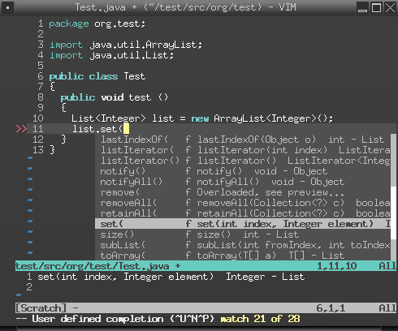

.. Copyright (C) 2005 - 2008  Eric Van Dewoestine

   This program is free software: you can redistribute it and/or modify
   it under the terms of the GNU General Public License as published by
   the Free Software Foundation, either version 3 of the License, or
   (at your option) any later version.

   This program is distributed in the hope that it will be useful,
   but WITHOUT ANY WARRANTY; without even the implied warranty of
   MERCHANTABILITY or FITNESS FOR A PARTICULAR PURPOSE.  See the
   GNU General Public License for more details.

   You should have received a copy of the GNU General Public License
   along with this program.  If not, see <http://www.gnu.org/licenses/>.

.. _vim/java/complete:

Java Code Completion
====================

Java code completion uses the standard <a href="../code_completion.html">Vim
code completion mechanism</a> like so\:

::

  System.o<Ctrl-X><Ctrl-U>
  System.out.pri<Ctrl-X><Ctrl-U>

Screenshot of completion in action\:

