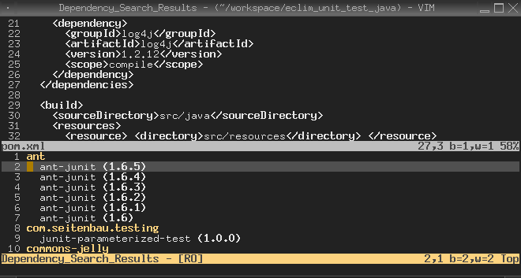

.. Copyright (C) 2005 - 2008  Eric Van Dewoestine

   This program is free software: you can redistribute it and/or modify
   it under the terms of the GNU General Public License as published by
   the Free Software Foundation, either version 3 of the License, or
   (at your option) any later version.

   This program is distributed in the hope that it will be useful,
   but WITHOUT ANY WARRANTY; without even the implied warranty of
   MERCHANTABILITY or FITNESS FOR A PARTICULAR PURPOSE.  See the
   GNU General Public License for more details.

   You should have received a copy of the GNU General Public License
   along with this program.  If not, see <http://www.gnu.org/licenses/>.

.. _vim/java/maven/dependencies:

Maven Dependencies
==================

.. _MavenDependencySearch:

.. _MvnDependencySearch:

Maven provides online repositories where it will download dependencies from at
build time.  One problem is that finding all your dependencies and then adding
them to your pom file can become labor intensive.  To help alleviate this, eclim
provides commands for searching via the web service provided by <a
href="http://maven.ozacc.com">maven.ozacc.com</a>.

- **:MavenDependencySearch** <artifact> -
  Available when editing a maven 1.x ``project.xml`` file.
- **:MvnDependencySearch** <artifact> -
  Available when editing a maven 2.x ``pom.xml`` file.

These two commands will search for the specified artifact and open a window
containing the results.  You can then add one the results as a dependency to
your pom file by simply hitting <enter> on it.

Example when calling ``:MvnDependencySearch junit``

