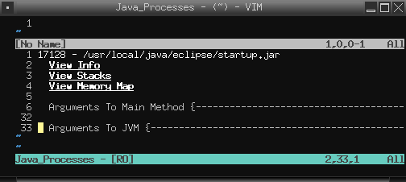

.. Copyright (C) 2005 - 2008  Eric Van Dewoestine

   This program is free software: you can redistribute it and/or modify
   it under the terms of the GNU General Public License as published by
   the Free Software Foundation, either version 3 of the License, or
   (at your option) any later version.

   This program is distributed in the hope that it will be useful,
   but WITHOUT ANY WARRANTY; without even the implied warranty of
   MERCHANTABILITY or FITNESS FOR A PARTICULAR PURPOSE.  See the
   GNU General Public License for more details.

   You should have received a copy of the GNU General Public License
   along with this program.  If not, see <http://www.gnu.org/licenses/>.

.. _vim/java/tools:

Java Tools Integration
======================

.. _Jps:

As of Java 1.5 (Java 5.0), the sun jdk started shipping with some useful tools
for viewing information about running java processes.  To provide quick and easy
access to some of the information these commands provide, eclim exposes the
command **:Jps**.

.. note::

  For more information on the jdk tools you may view the `online
  documentation`_.

When invoked it will open a window containing information about the current
processes and some links for viewing additional info (depending upon
availability of required tools on your platform).

Example content:

- Line 1 consists of the process id followed by either the class name the
  process was started with or the path to the jar file.
- Lines 2 - 4 contains links that when you hit <enter> on, will open another
  window displaying the requested additional info.
- Lines 6 - 31 is a folded block which contains a list of all the arguments
  passed to the main method of the process.
- Lines 33 - 35 is a folded block which contains a list of all the arguments
  passed to the JVM.

.. _online documentation: http://java.sun.com/j2se/1.5.0/docs/tooldocs/index.html#manage
